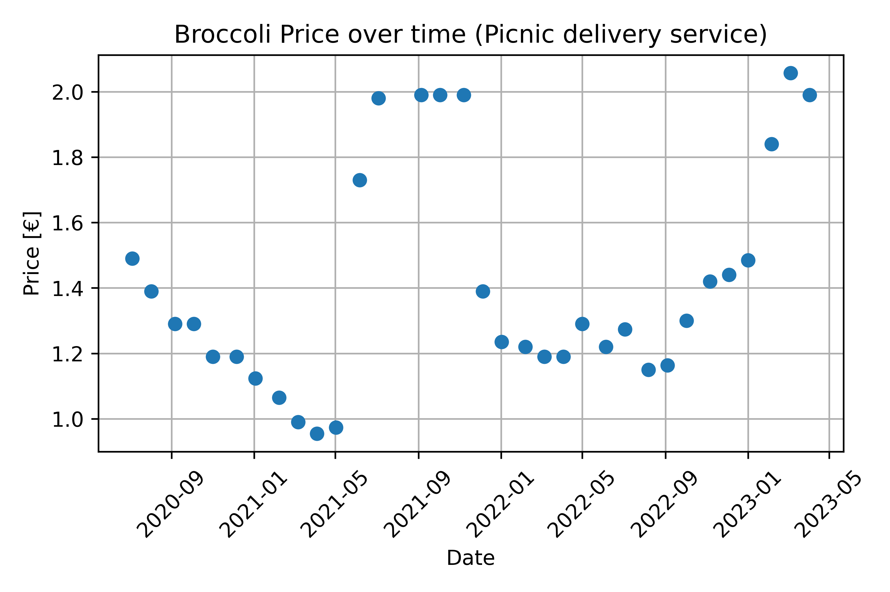

# Broccoli Price Plotter

This script allows you to plot the price of broccoli over time using receipt emails ("bonnetjes") from the Dutch food delivery service Picnic. The script extracts the price and date information from the emails using regular expressions, and generates a plot using Matplotlib.

## Usage

1. Download Broccoli.py script.
2. Install required packages numpy, pandas and matplotlib.
3. Put your Picnic receipt emails (as .eml files) in a folder.
4. Update the `directory` variable in the script to point to the folder containing your receipt emails.
5. Run the script with `python Broccoli.py`.
6. The resulting plot will be saved in the same directory as the script.

## License

This project is licensed under the MIT licence.

## Results from end of 2021 to spring 2023

